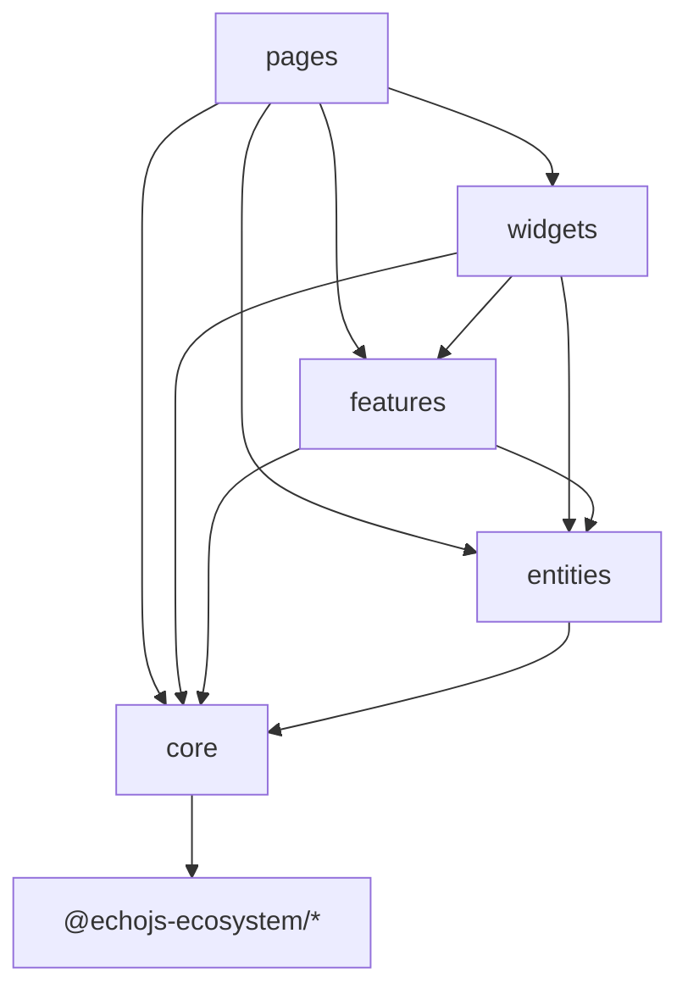

# Dependency Flow

Layers exist to keep refactors local. **Imports may only go down the stack** —
from routes toward shared utilities and framework packages, never the reverse.

## Allowed directions

```
pages  →  widgets, features, entities, core, @echojs-ecosystem/*
widgets  →  features, entities, core, @echojs-ecosystem/*
features  →  entities, core, @echojs-ecosystem/*
entities  →  core, @echojs-ecosystem/*
core  →  @echojs-ecosystem/*
```



## Forbidden (will rot quickly)

| Import                            | Why                                 |
| --------------------------------- | ----------------------------------- |
| `core` → `pages`                  | Core must stay generic              |
| `features` → `pages`              | Features cannot know routes         |
| `entities` → `widgets`            | Domain must not depend on UI        |
| `widgets` → `pages`               | Shell blocks are not route-specific |
| Any layer → unrelated `pages/foo` | Use a feature export instead        |

## Path aliases (monorepo apps)

Typical `tsconfig` paths:

| Alias         | Target           |
| ------------- | ---------------- |
| `@app/*`      | `src/app/*`      |
| `@pages/*`    | `src/pages/*`    |
| `@widgets/*`  | `src/widgets/*`  |
| `@features/*` | `src/features/*` |
| `@entities/*` | `src/entities/*` |
| `@core/*`     | `src/core/*`     |

Vite `resolve.alias` should mirror the same map so dev and typecheck agree.

## `@echojs-ecosystem/*` packages

Application layers may import published workspace packages:

- `@echojs-ecosystem/reactivity`, `@echojs-ecosystem/hyperdom`,
  `@echojs-ecosystem/framework`
- `@echojs-ecosystem/router`, `@echojs-ecosystem/async`,
  `@echojs-ecosystem/store`, …

Packages **must not** import application folders (`@pages`, etc.).

## Content and routes

| Module                | May import                                               |
| --------------------- | -------------------------------------------------------- |
| `entities/__routes__` | `pages/*.page.ts`, `core/content`                        |
| `core/content/nav.ts` | `entities/__routes__/doc-pages` for `docPageByContentId` |
| `pages/doc/*`         | `core/content/load-content`, widgets                     |

Avoid `core/content` importing widgets — keep content engine UI-agnostic.

## Circular dependency traps

1. **Nav ↔ routes** — `docPageByContentId` maps `contentId` → page objects; nav
   config lives in `core/content`, route table in `entities`. Break cycles by
   keeping a single registry (`doc-pages.ts`).

2. **Theme store ↔ header** — both use `core/providers` (theme store); neither
   imports the other’s widget folder.

3. **Router provider ↔ DocsChrome** — `app/router-provider.ts` wires the router;
   chrome imports `appRouter` from `app/router`. Import providers from
   `@core/providers/index.js`, not deep paths.

## Enforcement

Today boundaries are **convention + review**. Optional hardening:

- ESLint `import/no-restricted-paths` per layer
- Dependency-cruiser graphs in CI

> [!TIP] If an import feels wrong, extract a `shared/` or `features/` module
> with a narrow export.

## Checklist before merging

- [ ] No `pages/` imports from lower layers
- [ ] Features expose `index.ts` public API
- [ ] Route definitions only in `entities/__routes__`
- [ ] Styles use `core/styles` tokens, not magic strings in views

## Related

- Feature First — `/docs/architecture/feature-first`
- Project Structure — `/docs/getting-started/project-structure`
- AGENTS.md — `/docs/agents/agents`
