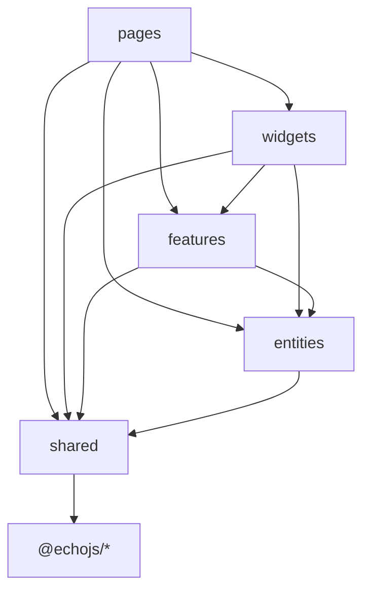

# Dependency Flow

Layers exist to keep refactors local. **Imports may only go down the stack** — from routes toward shared utilities and framework packages, never the reverse.

## Allowed directions

```
pages  →  widgets, features, entities, shared, @echojs/*
widgets  →  features, entities, shared, @echojs/*
features  →  entities, shared, @echojs/*
entities  →  shared, @echojs/*
shared  →  @echojs/*
```



## Forbidden (will rot quickly)

| Import | Why |
| --- | --- |
| `shared` → `pages` | Shared must stay generic |
| `features` → `pages` | Features cannot know routes |
| `entities` → `widgets` | Domain must not depend on UI |
| `widgets` → `pages` | Shell blocks are not route-specific |
| Any layer → unrelated `pages/foo` | Use a feature export instead |

## Path aliases (monorepo apps)

Typical `tsconfig` paths:

| Alias | Target |
| --- | --- |
| `@app/*` | `src/app/*` |
| `@pages/*` | `src/pages/*` |
| `@widgets/*` | `src/widgets/*` |
| `@features/*` | `src/features/*` |
| `@entities/*` | `src/entities/*` |
| `@shared/*` | `src/shared/*` |

Vite `resolve.alias` should mirror the same map so dev and typecheck agree.

## `@echojs/*` packages

Application layers may import published workspace packages:

- `@echojs/reactivity`, `@echojs/hyperdom`, `@echojs/framework`
- `@echojs/router`, `@echojs/query`, `@echojs/store`, …

Packages **must not** import application folders (`@pages`, etc.).

## Content and routes

| Module | May import |
| --- | --- |
| `entities/__routes__` | `pages/*.page.ts`, `shared/content` |
| `shared/content/nav.ts` | `entities/__routes__/doc-pages` for `docPageByContentId` |
| `pages/doc/*` | `shared/content/load-content`, widgets |

Avoid `shared/content` importing widgets — keep content engine UI-agnostic.

## Circular dependency traps

1. **Nav ↔ routes** — `docPageByContentId` maps `contentId` → page objects; nav config lives in `shared/content`, route table in `entities`. Break cycles by keeping a single registry (`doc-pages.ts`).

2. **Theme store ↔ header** — both use `shared/theme`; neither imports the other’s widget folder.

3. **Router provider ↔ DocsChrome** — provider imports chrome widget; chrome imports `appRouter` from entities. Do not import `app/providers` from widgets.

## Enforcement

Today boundaries are **convention + review**. Optional hardening:

- ESLint `import/no-restricted-paths` per layer
- Dependency-cruiser graphs in CI

> [!TIP]
> If an import feels wrong, extract a `shared/` or `features/` module with a narrow export.

## Checklist before merging

- [ ] No `pages/` imports from lower layers
- [ ] Features expose `index.ts` public API
- [ ] Route definitions only in `entities/__routes__`
- [ ] Styles use `shared/styles` tokens, not magic strings in views

## Related

- Feature First — `/docs/architecture/feature-first`
- Project Structure — `/docs/getting-started/project-structure`
- AGENTS.md — `/docs/agents/agents`
