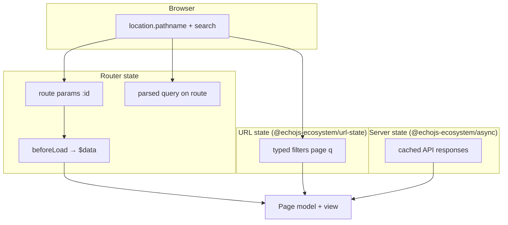

# State overview

EchoJS does not use one global Redux-style store. Applications combine **several
state layers**, each with a clear job. Mixing them (for example caching API data
in route params) causes bugs and duplicate sources of truth.

## The six layers

| Layer                                        | Driven by            | Package / API                                           | Typical examples                      |
| -------------------------------------------- | -------------------- | ------------------------------------------------------- | ------------------------------------- |
| [Router state](/docs/state/router-state)     | URL + navigation     | `@echojs-ecosystem/router`                              | `:userId`, `?tab=`, `beforeLoad` data |
| [URL state](/docs/state/url-state)           | Query string (typed) | `@echojs-ecosystem/url-state`                           | Search `q`, `page`, `view=grid`       |
| [Server state](/docs/state/server-state)     | HTTP / async         | `@echojs-ecosystem/async`                               | User list, product details            |
| [Form state](/docs/state/form-state)         | User input           | `@echojs-ecosystem/form`                                | Login fields, checkout lines          |
| [Client store](/docs/state/client-store)     | App logic            | `@echojs-ecosystem/store` + `@echojs-ecosystem/persist` | Theme, session, cart id               |
| [Local UI state](/docs/state/local-ui-state) | Interaction          | `@echojs-ecosystem/reactivity` in models                | Open modal, active tab index          |

**Locale** (active language) is provider state from `@echojs-ecosystem/i18n` —
global like a store, but read-only for most features except the language picker.

## How they relate to the URL

- **Router** owns _which page_ is open and _path_ segments (`/users/42`).
- **URL state** owns _optional query keys_ you want typed, validated, and easy
  to reset (often overlaps raw router query — prefer url-state for app filters).
- **Server state** is _not_ in the URL unless you deliberately mirror an id
  there.

## Pick the right layer

Ask in order:

1. **Is it in the address bar?**
   - Path segment → router params.
   - `?foo=bar` shareable → [URL state](/docs/state/url-state).

2. **Does it come from the server?**  
   → [Server state](/docs/state/server-state) (`createQuery`), not a store copy.

3. **Is it a form the user edits before submit?**  
   → [Form state](/docs/state/form-state).

4. **Must other features/routes see it without refetch?**  
   → [Client store](/docs/state/client-store) (session, theme).

5. **Only this screen/widget cares?**  
   → [Local UI state](/docs/state/local-ui-state) in a model.

> [!RECOMMENDATION] Models (`createModel`) **orchestrate** — they read
> router/query/store/form and expose a small VM to the view. Views do not choose
> layers themselves.

## What not to do

| Mistake                                   | Why it hurts                         | Fix                          |
| ----------------------------------------- | ------------------------------------ | ---------------------------- |
| Store API list in `createStore`           | Stale data, no refetch/invalidation  | `createQuery`                |
| Duplicate `:id` in a signal               | Drifts from URL on back/forward      | `page.$params`               |
| Put draft form values in global store     | Leaks across routes                  | `createForm` / fields        |
| Use `beforeLoad` for paginated list cache | No shared cache, refetch every visit | Query + url-state for `page` |
| One mega-store for everything             | Unclear ownership                    | Split by layer above         |

## Where code lives

| Layer           | Folder convention                          |
| --------------- | ------------------------------------------ |
| Router / guards | `entities/__routes__/`                     |
| Queries         | `features/*/api/*.queries.ts`              |
| URL parsers     | `features/*/url/` or next to feature model |
| Stores          | `entities/`, `app/`, `shared/`             |
| Forms           | `features/*/model/*-form.ts`               |
| Local UI        | `pages/**/model`, `features/**/model`      |

## Practical guides

Task-oriented walkthroughs (routing, fetching, forms, auth) live under
[Guides](/docs/guides/routing). Package reference:
[Router](/docs/packages/router/overview),
[Query](/docs/packages/async/overview), [Store](/docs/packages/store/overview),
[URL State](/docs/packages/url-state/overview).

## In this section

- [Router state](/docs/state/router-state) — params, query, loader data
- [Form state](/docs/state/form-state) — fields, validation, submit
- [Server state](/docs/state/server-state) — cache, mutations, staleness
- [URL state](/docs/state/url-state) — typed query params
- [Client store](/docs/state/client-store) — shared client + persist
- [Local UI state](/docs/state/local-ui-state) — signals in models
